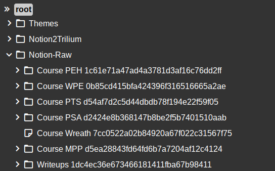
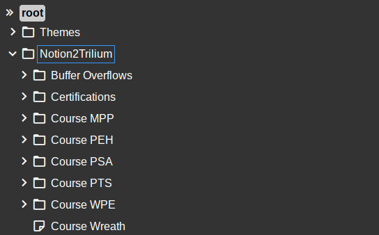

# Notion2Trilium
This bash script can tidy up notes exported from [Notion](https://www.notion.so/). 
When exporting notes, Notion adds an identifier hash to the end of every filename and creates directories with exported images. This looks ugly when directly imported to [Trilium](https://github.com/zadam/trilium). 

Notion2Trilium strips the hashes off the filenames and directories (Renaming notes to their original form as they appeared in Notion). 
As a consequence of renaming notes, links to images and other notes break during the process. However, Notion2Trilium loops through every note and fixes internal links.

# Usage:

1. Export notes from Notion
2. Unzip the exported file (e.g Export-xxxxxxxx-xxxx-xxxxx-xxxx-xxxxxxxxxxxx)
3. Rename the exported folder to `Notion-Export`
4. Download [`notion2trilium.sh`](https://github.com/TuxTheXplorer/Notion2Trilium/blob/main/notion2trilium.sh) from this repo and place it next to the `Notion-Export` folder
5. From a terminal run `chmod +x ./notion2trilium.sh` and `./notion2trilium.sh`
6. Wait for the conversion process to finish. (Might take 5-10 minutes depending on the size of your Notion export)
7. When the script if finished `zip` up the `Notion-Export` folder.
8. Import the resulting `Notion-Export.zip` into Trilium

# Notes:
- The script performs two operations. First it renames every file by stripping hashes off the end of filenames. During this process, a hash database is built of all the identified files from the Export. This database is used for the 2nd operation where internal links are fixed within every note.
- The hierarchy of notes is saved, however the vertical order of notes are reset to an alphabetical order during conversion.

## Before

## After

# Credits:
- Thank you Szymex for helping with the hash stripping
